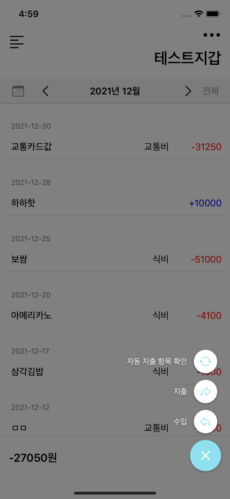

# CheckMoney iOS App
나의 소비 습관을 파악하기 위한 서비스 입니다.

- 지출이 발생할 때마다 사용 금액 및 사용처를 입력하여 저장
- 저장된 데이터들을 기반으로 월별/분야별 지출 내역을 정리하여 표시

# Preview

# Features

## Auth

구글 로그인 및 이메일 로그인을 지원합니다.

회원가입과 비밀번호 찾기는 이메일 검증 진행 후 진행 가능합니다.

Code [Link](https://github.com/CheckMooney/check-money-ios/tree/main/CheckMoney/CheckMoney/Auth)

    

## 

## Main

Charts 라이브러리를 이용한 요약 화면과 TableView를 이용한 거래 내역 리스트 조회 화면은 [MainViewController.swift](https://github.com/CheckMooney/check-money-ios/blob/main/CheckMoney/CheckMoney/Main/MainViewController.swift) 의 SubView로써 표시하였습니다.

Code [Link](https://github.com/CheckMooney/check-money-ios/tree/main/CheckMoney/CheckMoney/Main)

### 지출 내역 분석

지출 내역을 막대그래프와 원형그래프를 이용해 다양한 방식으로 정리하여 보여줍니다.

본인이 가장 많이 지출하는 카테고리, 혹은 일 평균 소비 정도 등을 한 눈에 확인할 수 있습니다.

### 지출/수입 내역 조회 및 등록

지갑을 여러 개 추가하여 지출 내역을 구분할 수 있습니다.

월별로 거래 내역을 확인할 수 있으며, 필요에 따라 전체 / 수입 / 지출 로 구분하여 내역을 확인할 수 있습니다.

    

  

### 유저 정보 수정

유저의 프로필 사진, 이름 및 비밀번호 변경이 가능합니다.

# Libraries

- [GoogleSignIn](https://developers.google.com/identity/sign-in/ios/sign-in)
- [JJFloatingActionButton](https://jjochen.github.io/JJFloatingActionButton/)
- [SideMenu](https://github.com/jonkykong/SideMenu)
- [Charts](https://github.com/danielgindi/Charts)
- [BetterCodable](https://github.com/marksands/BetterCodable)
- [Kingfisher](https://github.com/onevcat/Kingfisher)

